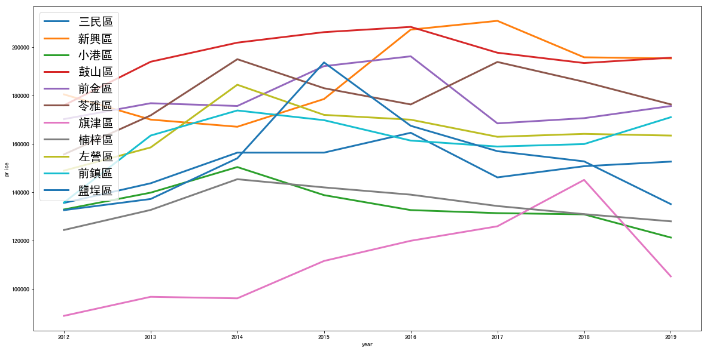

# 高雄市房價分析

* 使用公開資料查詢 https://plvr.land.moi.gov.tw 以年＋季 為查詢條件可下載zip檔
* 資料由101年開始到108年第二季
* 載回來後為CSV檔案

# 解壓縮到資料夾
* x_lvr_land_a：房屋買賣交易 / x_lvr_land_b：新成屋交易 / x_lvr_land_c：租房交易

```python
for d in dirs:
    print(d)
    df = pd.read_csv(os.path.join(d,estate_location), index_col=False)
    df['Q'] = d[-1]
    dfs.append(df.iloc[1:])
    
df = pd.concat(dfs, sort=True)
```

# 清洗資料

* 新增交易年份
```python
df['year'] = df['交易年月日'].str[:-4].astype(int) + 1911
```
* 單價元平方公尺資料合併，把平方公尺換算成坪數，每平方單價換成每坪單價
```python
df['單價元平方公尺'].fillna(df['單價元/平方公尺'], inplace=True)
df=df.drop(columns='單價元/平方公尺')
df['建物移轉面積坪數']=df['建物移轉總面積平方公尺'].astype(float) * 0.3025
df['單價元平方公尺'] = df['單價元平方公尺'].astype(float)
df['單價元坪'] = df['單價元平方公尺'].astype(float) * 3.30579
```
* 刪除有備註之交易（多為親友交易、價格不正常之交易）, 刪除建築型態為土地（未有建築物於地上)
* 清掉一些奇怪年度的資料 &  單坪0元的
```python
df = df[df['備註'].isnull()]
df=df[df['建物型態2'] != '其他']
df=df[df['year'] > 2009]
df=df[df['單價元坪']>0]
```
[Alt text](pc1.jpg)
* 將index改成年月日
```python
df.index = pd.to_datetime((df['交易年月日'].str[:-4].astype(int) + 1911).astype(str) + df['交易年月日'].str[-4:] ,errors='coerce')
```

* 建物型態資料太多，為了之後方便使用
```python
df['建物型態2'] = df['建物型態'].str.split('(').str[0]
```

* 算一下建築物年齡
```python
df['建築完成年月']=df['建築完成年月'].astype(str)
x=datetime.datetime.now()
nowyear=x.year

def AAA(genre):
    if genre == 'nan':
        return-1
    elif len(genre) < 4:
        return nowyear-(int(genre)+ 1911) 
    else:
        buildyear=int(genre[:-4])
        return nowyear-(buildyear + 1911)
        
df['建築年齡'] = df.apply(lambda x: AAA(x['建築完成年月']),axis=1)
```

* 太多舊高雄縣現為高雄市行政區，暫不考慮，加入之前的高雄縣太眼花瞭亂了
```python
df_city= df[df['鄉鎮市區'].isin(['左營區','鼓山區','楠梓區','三民區','苓雅區','新興區','前金區','鹽埕區','前鎮區','旗津區','小港區'])]
```

# 高雄市單價年平均
```python
prices = {}
for district in set(df_city['鄉鎮市區']):
    cond = (
        (df_city['主要用途'] == '住家用')
        & (df_city['鄉鎮市區'] == district)
        & (df_city['單價元坪'] < df_city["單價元坪"].quantile(0.95))
        & (df_city['單價元坪'] > df_city["單價元坪"].quantile(0.05))
        )
    groups = df_city[cond]['year']
    prices[district] = df_city[cond]['單價元坪'].astype(float).groupby(groups).mean().loc[2012:]
price_history = pd.DataFrame(prices)
plt.rcParams['font.sans-serif']=['SimHei'] 
plt.rcParams['axes.unicode_minus']=False
price_history.plot(figsize=(20,10),linewidth = 3)
plt.legend( labels = price_history.columns, loc = 'upper left',fontsize=20)
plt.figsize=(20,10)
plt.ylabel('price')
plt.xlabel('year')
```
##### 鼓山區的房價一直區於高處(但也挺保值沒有往下掉),新興區突然往上爬（是最近有什麼高級建案嗎)，苓雅區和前金區的價格一直上上下下
##### 然後最近開始前鎮區的單價開始超過左營區,三民區算是高雄區中等房價
##### 鹽埕區的單價好像不保值2015後一直快速往下掉,而楠梓區單價平穩但在高雄區僅高過小港和旗津區，應該要來個人口調查看看大家都住那裡


--------

# 高雄市房地產交易量
volume = {}
for district in set(df_city['鄉鎮市區']):
    cond = (
        (df_city['主要用途'] == '住家用')
        & (df_city['鄉鎮市區'] == district)
        & (df_city['單價元坪'] < df_city["單價元坪"].quantile(0.95))
        & (df_city['單價元坪'] > df_city["單價元坪"].quantile(0.05))
        )
    groups = df_city[cond]['year']
    volume[district] = df_city[cond]['單價元坪'].astype(float).groupby(groups).count().loc[2012:]
volume_history = pd.DataFrame(volume)

volume_history.plot(figsize=(20,10),linewidth = 3)
plt.legend( labels = volume_history.columns, loc = 'upper left',fontsize=20)
plt.figsize=(20,10)
plt.ylabel('volume')
plt.xlabel('year')


##### 交易量 都由2013年開始往下掉，看起來 目前交易量多的也落在 鼓山，左營，三民(三者比較接近的成交量)
##### 楠梓的成交量看起來有掉比較多的現象（難道發現真的離市區太遙遠了)


